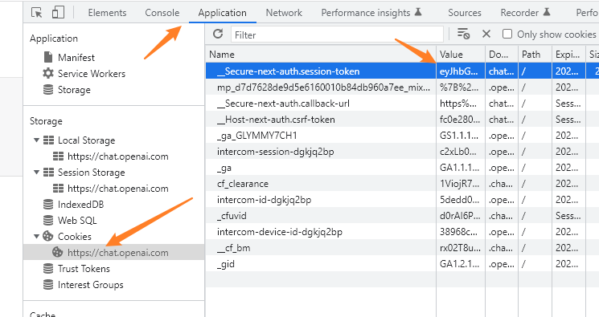

https://github.com/acheong08/ChatGPT/wiki/Setup

# 在客户端上

```bash
$ pip3 install --upgrade revChatGPT
```

```python
from revChatGPT.ChatGPT import Chatbot

chatbot = Chatbot({
    "session_token": "<token>"
}, conversation_id=None, parent_id=None)  # You can start a custom conversation

# You can specify custom conversation and parent ids. Otherwise it uses the saved conversation (yes. conversations are automatically saved)
response = chatbot.ask("explain what is China",
                       conversation_id=None, parent_id=None)

print(response)
```

在此处获得token



# 在服务器端

xvfb允许在无图形用户界面的系统上运行图形化程序。

```bash
$ sudo apt-get update
$ sudo apt-get install xvfb

```

不过因为cloudfare的限制，这个几乎不再可用

conversation_id 指的是同一个对话的编号

parent_id 指的是上一个句子的编号

https://github.com/acheong08/ChatGPT/issues/7

https://aistudio.baidu.com/aistudio/projectdetail/5229445?channelType=0&channel=0


https://www.google.com/search?q=what+are+conversation_id+%EF%BC%8C+parent_id+in+chatgpt&oq=what+are+conversation_id+%EF%BC%8C+parent_id++in+chatgpt&aqs=chrome..69i57.14396j0j4&sourceid=chrome&ie=UTF-8
